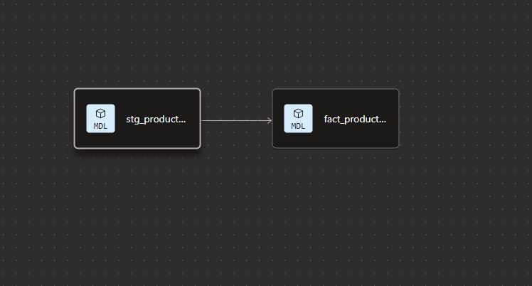
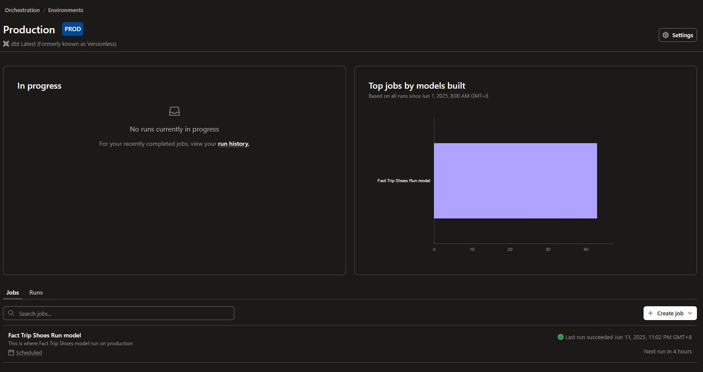

  
    
  
  
    
  
  
    
  

  <strong>You are viewing: <code>ph-shoes-dbt-analytics</code> repository</strong>

---

# DBT Analytics Overview

  

The `ph-shoes-dbt-analytics` project handles the transformation layer of the PH Shoes pipeline. It ingests raw product data loaded into Snowflake and converts it into a structured, validated, and analytics-ready **fact model**.

The main output model is:

### 🔷 `fact_product_shoes`

This model represents the **canonical daily snapshot** of scraped shoe products, merged with batch metadata and cleaned fields. It is built on top of a staging model (`stg_product_shoes`) and is materialized incrementally.

It includes key fields like:

* `dwid`, `year`, `month`, `day` for batch-level metadata
* `id`, `title`, `subTitle`, `url`, and `image` for product identity
* `price_sale`, `price_original` for pricing
* `brand`, `gender`, `age_group` for categorization

Field-level tests such as `not_null`, `unique`, and primary key constraints are enforced to guarantee consistency.

---

### 🛠️ Model Scheduling & Execution

  

The DBT Cloud job (`Fact Trip Shoes Run model`) is scheduled to run **daily**, shortly after raw files are ingested into Snowflake. This ensures transformed data is always up to date and queryable by the backend and AI services.
